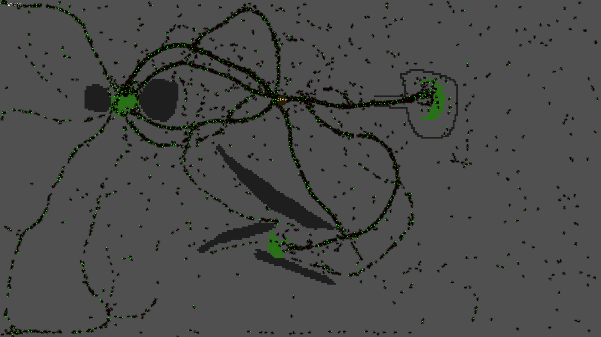

# Overview 🐜
A simple ant simulator that attempts to mimic and visualize the pheromone-based system some ant colonies in nature employ to find and retrieve food.



# Installation
## Dependencies
You will need [Java](https://www.java.com/en/download/) to run the simulation. 

To build from source, you will need a Java Development Kit (JDK), available from either [here](https://jdk.java.net/) or your package manager of choice.
You may need to downgrade to Java 8, as some bundled dependencies don't seem to play nicely with newer versions of Java.

## Downloads
Get the latest version from [releases](https://github.com/gekoke/AntSimulator/releases) and run it using `java -jar AntSimulator.jar`

## Build from source
First, clone the repository:
```shell
git clone https://github.com/gekoke/ants
cd ants
```
To run the project once:
```shell
./gradlew run  # Or "gradlew.bat" on Windows
```

To build and run a jar file:
```shell
./gradlew jar
java -jar build/libs/AntSimulator.jar
```

# Usage
## Controls
| Key | Action |
| --- | ---    |
| **Mouse** | Place food chunks or walls |
| **A**     | Toggle ant visibility      |
| **W**     | Toggle between food/wall mode |
| **S**     | Increase simulation speed (4x) |
| **F**     | Toggle pheromone visibility |
| **P**     | Pause the simulation |
